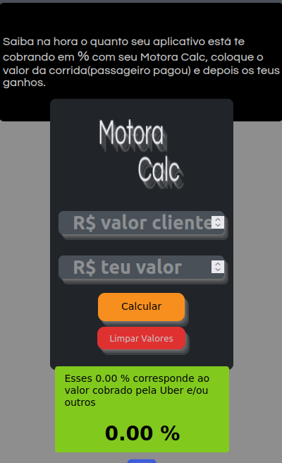

## Preview



## Motora Calc

Este é um projeto criado com React-js, Next-js, estilos com CSS e feito deploy com Vercel, disponível neste link [Motora Calc](https://motora-calc.vercel.app/), criado para motoristas de aplicativo, este app basicamente explícita ao motorista a porcentagem que as empresas cobram dos mesmos, coloque o valor que o cliente pagou em cima e logo abaixo coloque o valor liquido recebido, abaixo terá o cálculo em %.

Criado para ser mais utilizado em dispositivos móveis.

# Calculadora Calculadora


## Getting Started

Para rodar em desenvolvimento basta clonar e:

```yarn``` ou
```npm install``` para instalar as dependências.

```bash
npm run dev
# or
yarn dev
```

abra [http://localhost:3000](http://localhost:3000) com seu browser. 


